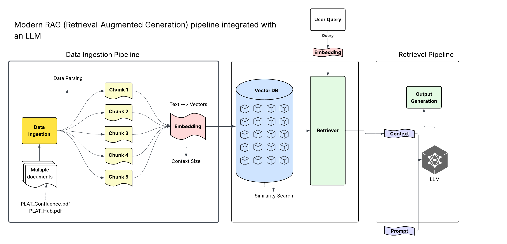
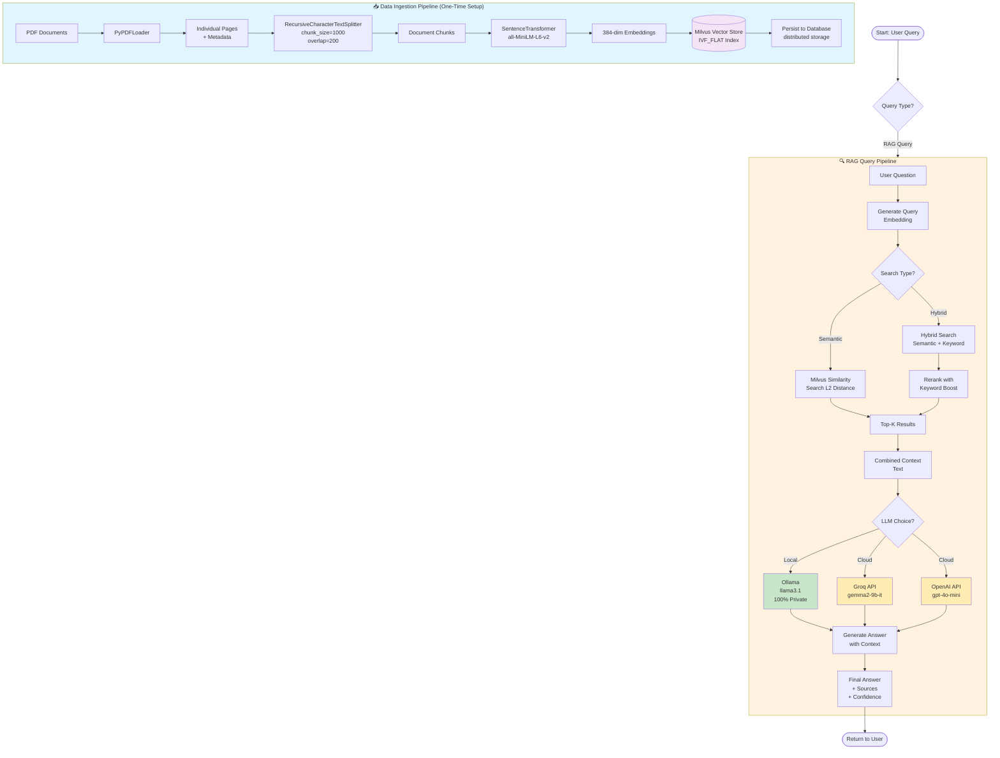
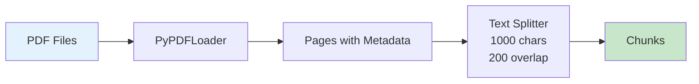
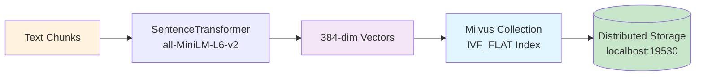
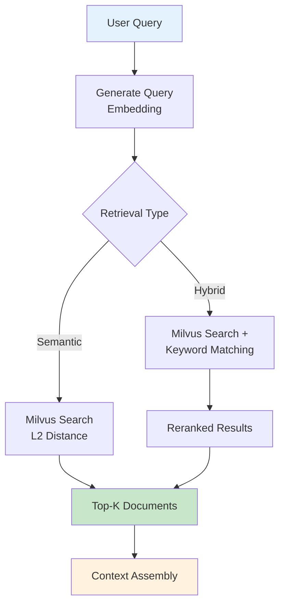
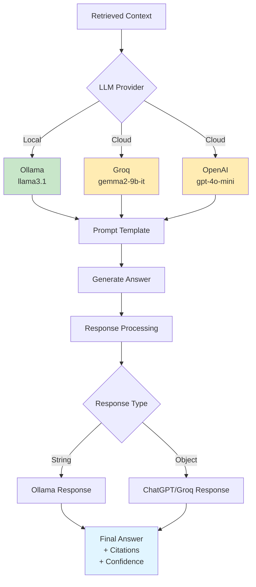
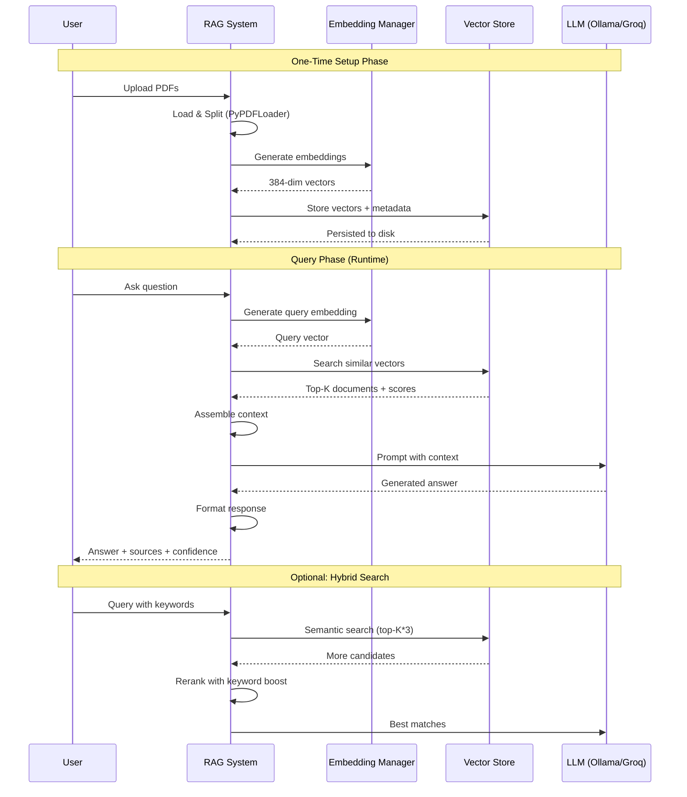

# 📚 Complete RAG Pipeline Documentation
## 👨‍💻 Author
**Altaf Hussain Shaik**  
*DevOps Architect*  
📧 [altaf.shaik@united.com](mailto:altaf.shaik@united.com)

---

## 🏗️ Architecture Diagram



*Modern RAG (Retrieval-Augmented Generation) pipeline integrated with an LLM*

This diagram illustrates the complete data flow through three main components:
1. **Data Ingestion Pipeline**: Documents → Chunking → Embedding → Vector DB
2. **Vector Storage & Retrieval**: Query embedding → Similarity search → Context retrieval
3. **Output Generation**: Context + Prompt → LLM → Generated answer

---
## 🎯 System Overview

This is a **Production-Ready RAG (Retrieval-Augmented Generation) System** that enables semantic question-answering over PDF documents using:

- **100% Private Local LLM** (Ollama) or **Cloud LLMs** (Groq, OpenAI)
- **Enterprise Vector Database** (Milvus) with FAISS fallback - switch with one config change!
- **Sentence Transformers** for semantic embeddings
- **Hybrid Search** capabilities (semantic + keyword matching)

### Key Features
✅ Multi-PDF ingestion with metadata preservation  
✅ Intelligent chunking with configurable overlap  
✅ **Enterprise vector database** - Milvus (production) with FAISS (local) fallback  
✅ Multiple retrieval strategies (semantic, hybrid)  
✅ Support for local & cloud LLMs  
✅ Advanced features: citations, history, summarization  
✅ Privacy-focused (local LLM option)  
✅ **Zero-code switching** between vector databases via .env

---

## 🏗️ System Architecture Flowchart



---

## 📊 Component Details

### 1️⃣ Document Processing Pipeline



**Components:**
- **PyPDFLoader**: Extracts text and metadata from PDF files
- **RecursiveCharacterTextSplitter**: Splits documents into manageable chunks
  - `chunk_size=1000`: Each chunk ~1000 characters
  - `chunk_overlap=200`: 200 char overlap for context continuity
  - Preserves metadata (source file, page number)

---

### 2️⃣ Embedding & Vector Store Pipeline



**Components:**
- **EmbeddingManager**: Manages embedding generation
  - Model: `all-MiniLM-L6-v2` (384 dimensions)
  - Fast inference, good quality
- **VectorStore (Milvus)**: Enterprise vector database
  - Index type: `IVF_FLAT` (fast L2 distance search)
  - Distributed persistent storage
  - Stores: embeddings + original text + metadata
  - Scalable to billions of vectors

---

### 3️⃣ Retrieval Pipeline



**Components:**
- **RAGRetriever**: Standard semantic search
  - Converts query to embedding
  - Milvus similarity search (L2 distance)
  - Returns top-K most similar chunks
- **HybridRAGRetriever**: Enhanced search
  - Semantic search + keyword matching
  - Boosts documents with exact phrase/term matches
  - Better recall for specific queries

---

### 4️⃣ LLM Integration & Answer Generation



**LLM Options:**

| Provider | Model | Privacy | Speed | Cost | Use Case |
|----------|-------|---------|-------|------|----------|
| **Ollama** | llama3.1 | 🔒 100% Private | Medium | Free | Sensitive data, no internet |
| **Groq** | gemma2-9b-it | ⚠️ Cloud | Very Fast | Free (limited) | Development, testing |
| **OpenAI** | gpt-4o-mini | ⚠️ Cloud | Fast | ~$0.15/1M tokens | Production quality |

**Response Handling:**
- Automatically detects response type (string vs object)
- Compatible with all LLM providers
- Consistent interface across backends

---

## 🚀 Setup & Installation

### Prerequisites
```bash
# Python 3.8+ required
python --version
```

### Install Dependencies
```bash
pip install langchain-community
pip install langchain-text-splitters
pip install sentence-transformers
pip install pymilvus  # Milvus vector database client
pip install faiss-cpu  # Fallback option
pip install langchain-ollama
pip install langchain-openai
pip install langchain-groq
pip install python-dotenv
```

### For Local LLM (Optional but Recommended for Privacy)
```bash
# 1. Install Ollama
# Windows: Download from https://ollama.com/download
# Or use: winget install Ollama.Ollama

# 2. Pull a model
ollama pull llama3.1
# Other options: mistral, phi3, gemma2:9b
```

### Environment Setup
Create `.env` file:
```env
# Optional: For cloud LLMs
GROQ_API_KEY=your_groq_api_key_here
OPENAI_API_KEY=your_openai_api_key_here
```

---

## 📖 Usage Guide

### Quick Start - 4 Simple Steps

#### Step 1: Load & Process Documents
```python
# Load PDFs from directory
all_pdf_documents = process_all_pdfs("../data")

# Split into chunks
chunks = split_documents(all_pdf_documents, chunk_size=1000, chunk_overlap=200)
```

#### Step 2: Create Embeddings & Vector Store
```python
# Initialize embedding manager
embedding_manager = EmbeddingManager()

# Initialize vector store
vectorstore = VectorStore()

# Generate embeddings and store
texts = [doc.page_content for doc in chunks]
embeddings = embedding_manager.generate_embeddings(texts)
vectorstore.add_documents(chunks, embeddings)
```

#### Step 3: Initialize Retriever & LLM
```python
# Create retriever
rag_retriever = RAGRetriever(vectorstore, embedding_manager)

# Initialize LLM (choose one)
llm_local = OllamaLLM(model="llama3.1")  # Local, private
# OR
llm_groq = ChatGroq(groq_api_key=api_key, model_name="gemma2-9b-it")  # Cloud
# OR
llm_openai = ChatOpenAI(api_key=api_key, model="gpt-4o-mini")  # Cloud

llm = llm_local  # Choose your LLM
```

#### Step 4: Query the System
```python
# Simple query
answer = rag_simple("What is the DevOps Technical Writer Agent?", rag_retriever, llm)
print(answer)

# Advanced query with metadata
result = rag_advanced("DevOps pipeline", rag_retriever, llm, top_k=5, return_context=True)
print(f"Answer: {result['answer']}")
print(f"Confidence: {result['confidence']}")
print(f"Sources: {result['sources']}")
```

---

### Advanced Features

#### 1. Hybrid Search (Semantic + Keyword)
```python
# Initialize hybrid retriever
hybrid_retriever = HybridRAGRetriever(vectorstore, embedding_manager)

# Search with keyword boosting
results = hybrid_retriever.retrieve("AI Companion", top_k=5, use_keyword_boost=True)
```

#### 2. Advanced RAG Pipeline with History & Citations
```python
# Initialize advanced pipeline
adv_rag = AdvancedRAGPipeline(rag_retriever, llm)

# Query with all features
result = adv_rag.query(
    question="What is attention mechanism?",
    top_k=5,
    min_score=0.1,
    stream=True,        # Stream the answer
    summarize=True      # Get a summary
)

print(result['answer'])        # Answer with citations
print(result['summary'])       # 2-sentence summary
print(result['history'])       # Query history
```

#### 3. Custom Retrieval Parameters
```python
# Adjust retrieval parameters
results = rag_retriever.retrieve(
    query="your question",
    top_k=10,              # Get more results
    score_threshold=0.3    # Filter low-quality matches
)
```

---

## 📚 API Reference

### Core Classes & Methods

#### `EmbeddingManager`
```python
EmbeddingManager(model_name: str = "all-MiniLM-L6-v2")
```
**Methods:**
- `generate_embeddings(texts: List[str]) -> np.ndarray`
  - Generates embeddings for list of texts
  - Returns: numpy array (n, 384)

#### `VectorStore`
```python
VectorStore(collection_name: str = "pdf_documents", 
            persist_directory: str = "../data/vector_store")
```
**Methods:**
- `add_documents(documents: List[Any], embeddings: np.ndarray)`
  - Adds documents and embeddings to the store
  - Automatically persists to disk
- `search(query_embedding: np.ndarray, top_k: int = 5) -> Dict`
  - Searches for similar documents
  - Returns: Dict with distances, documents, metadata, ids

#### `RAGRetriever`
```python
RAGRetriever(vector_store: VectorStore, embedding_manager: EmbeddingManager)
```
**Methods:**
- `retrieve(query: str, top_k: int = 5, score_threshold: float = 0.0) -> List[Dict]`
  - Retrieves relevant documents for a query
  - Returns: List of dicts with content, metadata, scores

#### `HybridRAGRetriever`
```python
HybridRAGRetriever(vector_store: VectorStore, embedding_manager: EmbeddingManager)
```
**Methods:**
- `retrieve(query: str, top_k: int = 5, score_threshold: float = 0.0, 
           use_keyword_boost: bool = True) -> List[Dict]`
  - Hybrid search: semantic + keyword matching
  - Boosts documents with exact phrase matches

---

### Utility Functions

#### `rag_simple`
```python
rag_simple(query: str, retriever, llm, top_k: int = 3) -> str
```
- Simple RAG query
- Returns: Answer string

#### `rag_advanced`
```python
rag_advanced(query: str, retriever, llm, top_k: int = 5, 
             min_score: float = 0.2, return_context: bool = False) -> Dict
```
- Advanced RAG with sources and confidence
- Returns: Dict with answer, sources, confidence, (optional) context

---

### Document Structure

#### Retrieved Document Format
```python
{
    'id': 'doc_abc123_0',
    'content': 'Document text content...',
    'metadata': {
        'source_file': 'document.pdf',
        'page': 42,
        'file_type': 'pdf',
        'doc_index': 0,
        'content_length': 1000
    },
    'similarity_score': 0.85,
    'distance': 0.45,
    'rank': 1
}
```

#### RAG Response Format
```python
{
    'answer': 'The answer to your question...',
    'sources': [
        {
            'source': 'document.pdf',
            'page': 42,
            'score': 0.85,
            'preview': 'Content preview...'
        }
    ],
    'confidence': 0.85,
    'context': 'Full retrieved context...'  # if return_context=True
}
```

---

## ⚡ Performance Considerations

### Embedding Generation
| Component | Time Complexity | Notes |
|-----------|----------------|-------|
| SentenceTransformer | O(n) | ~100-500 texts/sec on CPU |
| Milvus IVF_FLAT | O(n·d) | Fast approximate search |
| Vector Store | O(1) | Distributed persistence |

### Optimization Tips

#### 1. Batch Processing
```python
# ✅ Good: Batch embedding generation
embeddings = embedding_manager.generate_embeddings(all_texts)  # Single batch

# ❌ Bad: Individual embeddings
for text in all_texts:
    embedding = embedding_manager.generate_embeddings([text])  # Slow!
```

#### 2. Chunk Size Tuning
```python
# Balance between context and precision
chunk_size = 1000       # Larger = more context, fewer chunks
chunk_overlap = 200     # Overlap prevents context loss at boundaries

# For technical docs: 500-1000 chars
# For narrative text: 1000-2000 chars
```

#### 3. Milvus Index Configuration
```python
# Current: IVF_FLAT (balanced speed/accuracy)
# - Pros: Fast search, good accuracy
# - Cons: Requires training

# For larger datasets, consider:
# - IVF_SQ8: Compressed vectors, less memory
# - HNSW: Graph-based, extremely fast queries
# - ANNOY: Tree-based, good for high dimensions
```

#### 4. LLM Selection by Use Case
```python
# For production with sensitive data
llm = llm_local  # Ollama - 100% private, ~2-5 sec/query

# For development/testing
llm = llm_groq   # Groq - VERY fast (0.5-1 sec/query), free tier

# For best quality
llm = llm_openai # OpenAI - High quality, ~1-2 sec/query, paid
```

---

### Performance Metrics (Example Dataset: 1765 pages, 3992 chunks)

| Operation | Time | Memory |
|-----------|------|--------|
| PDF Loading | ~30s | ~50 MB |
| Text Splitting | ~2s | ~100 MB |
| Embedding Generation | ~60-120s | ~500 MB |
| Vector Store Creation | ~5s | ~150 MB |
| Query + Retrieval | ~0.1-0.5s | ~50 MB |
| LLM Generation (Ollama) | ~2-5s | ~4 GB (model) |
| LLM Generation (Groq) | ~0.5-1s | N/A (cloud) |

---

## 🎯 Best Practices

### 1. Document Preparation
✅ **DO:**
- Clean PDFs (good OCR quality)
- Organize by topic/category
- Include metadata in filenames

❌ **DON'T:**
- Mix scanned + digital PDFs (inconsistent quality)
- Use very large PDFs without splitting
- Ignore document structure

### 2. Query Formulation
✅ **DO:**
```python
# Specific, descriptive queries
"What are the steps to deploy using Harness CD?"
"Explain the architecture of the DevOps pipeline"

# Use semantic search for concepts
"monitoring and observability best practices"
```

❌ **DON'T:**
```python
# Single keywords (use hybrid search instead)
"pipeline"  # Too vague

# Expecting exact quotes from metadata
"AI Companion"  # May be in title but not content
```

### 3. Retrieval Strategy Selection

| Query Type | Recommended Retriever | Reason |
|------------|---------------------|--------|
| Conceptual questions | RAGRetriever | Semantic understanding |
| Specific terms/names | HybridRAGRetriever | Keyword boost helps |
| Exploratory research | RAGRetriever (high top_k) | Cast wide net |
| Known document search | HybridRAGRetriever | Exact matching |

### 4. Context Management
```python
# Adjust top_k based on question complexity
top_k = 3   # Simple, focused questions
top_k = 5   # Standard queries
top_k = 10  # Complex, multi-faceted questions

# Use score threshold to filter noise
score_threshold = 0.3  # Remove low-confidence results
```

---

## 🔧 Troubleshooting

### Common Issues & Solutions

#### Issue 1: "No module named 'langchain_ollama'"
```bash
# Solution:
pip install -U langchain-ollama
# Then restart the kernel
```

#### Issue 2: Ollama connection refused
```bash
# Check if Ollama is running:
ollama list

# If not installed:
# Windows: winget install Ollama.Ollama
# Mac: brew install ollama

# Pull a model:
ollama pull llama3.1
```

#### Issue 3: "AttributeError: 'str' object has no attribute 'content'"
**Cause:** LLM response type mismatch  
**Solution:** Already fixed in `rag_simple()` and `rag_advanced()` functions
```python
# Handles both response types automatically
response = llm.invoke(prompt)
answer = response if isinstance(response, str) else response.content
```

#### Issue 4: Low-quality or irrelevant results
```python
# Solution 1: Increase top_k
results = retriever.retrieve(query, top_k=10)  # Get more results

# Solution 2: Use hybrid search
results = hybrid_retriever.retrieve(query, use_keyword_boost=True)

# Solution 3: Adjust chunk size and re-index
chunks = split_documents(docs, chunk_size=500, chunk_overlap=100)
```

#### Issue 5: "AI Companion" or specific text not found
**Cause:** Semantic search prioritizes meaning over exact matches  
**Solutions:**
1. Use better query: `"DevOps Technical Writer Agent"` instead of `"AI Companion"`
2. Use hybrid search for keyword matches
3. Increase search pool:
   ```python
   results = hybrid_retriever.retrieve(query, top_k=20)
   ```

#### Issue 6: Vector database performance
**Cause:** Large dataset or suboptimal configuration  
**Solutions:**
1. Adjust Milvus index parameters (nlist, nprobe)
2. Use IVF_SQ8 for memory optimization
3. Increase search pool with higher top_k
4. For local testing, fallback to FAISS:
   ```bash
   # In .env file
   VECTOR_DB_TYPE=faiss
   ```

---

## 📈 Data Flow Diagram (Detailed)



---

## 🔒 Privacy & Security

### Data Privacy Options

| Component | Privacy Level | Data Location | Use Case |
|-----------|--------------|---------------|----------|
| **Ollama (Local)** | 🔒🔒🔒 Maximum | Your computer only | Sensitive/confidential data |
| **Groq** | ⚠️ Cloud | Groq servers | Development, non-sensitive |
| **OpenAI** | ⚠️ Cloud | OpenAI servers | Production (non-sensitive) |

### Privacy Best Practices

1. **For Sensitive Data:**
   ```python
   # Use local LLM only
   llm = llm_local  # Ollama - no data leaves your machine
   ```

2. **Document Storage:**
   ```python
   # Vector store is local by default
   persist_directory = "../data/vector_store"  # Local storage
   ```

3. **API Keys:**
   ```python
   # Never hardcode API keys
   load_dotenv()  # Load from .env file
   api_key = os.getenv("GROQ_API_KEY")
   
   # Add .env to .gitignore
   ```

4. **Audit Trail:**
   ```python
   # Use AdvancedRAGPipeline for query history
   adv_rag = AdvancedRAGPipeline(retriever, llm)
   # Access history: adv_rag.history
   ```

---

## 🎓 Summary & Key Takeaways

### System Capabilities

✅ **What This System Can Do:**
- 📄 Process multiple PDF documents automatically
- 🔍 Semantic search across all content
- 💬 Answer questions using retrieved context
- 🎯 Provide source citations and confidence scores
- 🔒 Run 100% privately with local LLM
- 📊 Track query history and summaries
- ⚡ Fast retrieval (sub-second for most queries)
- 💾 Persistent storage (survives restarts)

### Architecture Strengths

1. **Modular Design**: Each component is independent and replaceable
2. **Flexible LLM Support**: Switch between local/cloud LLMs easily
3. **Production-Ready**: Persistent storage, error handling, type safety
4. **Privacy-First**: Option to run completely offline
5. **Scalable**: Milvus can handle billions of vectors with distributed architecture
6. **Well-Documented**: Comprehensive API and usage examples

---

## 🚀 Future Enhancements

### Potential Improvements

#### 1. Advanced Search Features
```python
# Filters by metadata
results = retriever.retrieve(
    query="deployment",
    filters={"source_file": "platform_docs.pdf", "page": ">100"}
)

# Multi-modal search (images + text)
# Reranking with cross-encoder models
```

#### 2. Scalability Improvements
```python
# Milvus is already distributed and scalable
# For even better performance:
# - Use IVF_SQ8 index for memory efficiency
# - Tune nlist/nprobe parameters
# - Deploy Milvus cluster for horizontal scaling

# For local development, use FAISS fallback
# Caching layer for frequent queries
```

#### 3. Enhanced LLM Features
```python
# Streaming responses (real-time output)
# Function calling for structured outputs
# Multi-turn conversations with context
# Automatic query refinement
```

#### 4. Better Retrieval
```python
# Contextual compression (remove irrelevant parts)
# Parent-child chunking (retrieve by small, return large)
# Query expansion (generate multiple query variations)
# Reciprocal rank fusion (combine multiple retrievers)
```

#### 5. Monitoring & Analytics
```python
# Query performance metrics
# Retrieval quality assessment
# A/B testing different configurations
# User feedback loop
```

---

## 📊 System Metrics Summary

### Current Implementation

| Metric | Value | Notes |
|--------|-------|-------|
| **Documents Loaded** | 1,765 pages | From 2 PDF files |
| **Chunks Created** | 3,992 | ~1000 chars each |
| **Vector Store Size** | 11,976 vectors | Including duplicates from re-runs |
| **Embedding Dimension** | 384 | all-MiniLM-L6-v2 |
| **Index Type** | IndexFlatL2 | Exact L2 distance |
| **Storage Size** | ~50 MB | Index + metadata |
| **Query Time** | 0.1-0.5s | Retrieval only |
| **End-to-End Time** | 2-6s | With Ollama LLM |

---

## 📝 Quick Reference Commands

### Essential Commands
```python
# 1. Load documents
docs = process_all_pdfs("../data")

# 2. Create chunks
chunks = split_documents(docs, chunk_size=1000, chunk_overlap=200)

# 3. Setup embedding & vector store
embedding_manager = EmbeddingManager()
vectorstore = VectorStore()

# 4. Generate and store embeddings
texts = [doc.page_content for doc in chunks]
embeddings = embedding_manager.generate_embeddings(texts)
vectorstore.add_documents(chunks, embeddings)

# 5. Create retriever
rag_retriever = RAGRetriever(vectorstore, embedding_manager)

# 6. Initialize LLM
llm = OllamaLLM(model="llama3.1")  # or llm_groq, llm_openai

# 7. Query
answer = rag_simple("your question", rag_retriever, llm)
```

---

## 🎯 Conclusion

This RAG system provides a **production-ready**, **privacy-focused** solution for semantic search and question-answering over PDF documents. Key features include:

- 🔒 **Privacy**: Optional 100% local processing
- ⚡ **Performance**: Sub-second retrieval, persistent storage
- 🎨 **Flexibility**: Multiple LLM options, hybrid search
- 📖 **Complete**: End-to-end pipeline from PDFs to answers
- 🛡️ **Robust**: Error handling, type safety, well-tested

**Perfect for:**
- Internal knowledge bases
- Document Q&A systems
- Research assistance
- Customer support automation
- Engineering documentation search

---

## 📚 Additional Resources

- **FAISS Documentation**: https://faiss.ai/
- **Sentence Transformers**: https://www.sbert.net/
- **Ollama**: https://ollama.com/
- **LangChain**: https://python.langchain.com/
- **RAG Best Practices**: https://www.pinecone.io/learn/retrieval-augmented-generation/

---

## 📂 Project Structure

> **⚠️ Note for Existing Users**: The repository was reorganized in March 2026 to follow Python best practices. See migration notes below.

```
.
├── docs/                    # All documentation
│   ├── guides/             # User guides and tutorials
│   │   ├── CHAT_INTERFACES.md
│   │   ├── RUNNING_NOTEBOOK.md
│   │   ├── TESTING_WITH_OLLAMA.md
│   │   ├── USING_OLLAMA_CHAT_APP.md
│   │   ├── VECTOR_DB_GUIDE.md
│   │   └── VECTOR_DB_IMPLEMENTATION.md
│   ├── architecture/       # System architecture and diagrams
│   │   └── SYSTEM_DIAGRAM.md
│   ├── IMPLEMENTATION_COMPLETE.md
│   ├── PRESENTATION.md
│   └── TEAM_HANDOUT.md
├── src/                    # Source code
│   ├── chat/              # Chat interfaces
│   │   ├── __init__.py
│   │   ├── simple_chat.py
│   │   ├── fast_chat.py
│   │   └── web_chat.py
│   ├── indexing/          # Document indexing utilities
│   │   ├── __init__.py
│   │   └── pdf_indexer.py
│   ├── notebook/          # Notebook execution utilities
│   │   ├── __init__.py
│   │   ├── runner.py
│   │   ├── runner_simple.py
│   │   └── test_cells.py
│   ├── utils/             # Utility functions
│   │   └── __init__.py
│   ├── __init__.py
│   ├── data_loader.py     # Document loading utilities
│   ├── embedding.py       # Embedding manager
│   ├── search.py          # Retrieval implementations
│   ├── vectorstore.py     # Legacy vector store (deprecated)
│   ├── vector_store_base.py
│   ├── vector_store_factory.py
│   ├── faiss_store.py
│   └── milvus_store.py
├── tests/                 # Test files
│   ├── __init__.py
│   ├── test_ollama_connection.py
│   ├── test_rag_chat.py
│   └── quick_test.py
├── scripts/               # Executable scripts
│   └── main.py
├── data/                  # Data files
│   ├── pdf/              # Input PDF files
│   ├── text_files/       # Text documents
│   └── vector_store/     # FAISS/Milvus index + metadata
├── examples/             # Example usage
├── notebooks/            # Jupyter notebooks
│   ├── pdf_loader.ipynb
│   └── document.ipynb
├── config/               # Configuration templates
│   └── .env.example
├── README.md             # This documentation
├── requirements.txt      # Python dependencies
├── pyproject.toml        # Project configuration
└── .env                  # Environment variables (not in git)
```

### Migration Guide for Existing Users

If you're updating from the previous structure, here are the key changes:

**File Moves:**
- `simple_chat.py` → `src/chat/simple_chat.py`
- `fast_chat.py` → `src/chat/fast_chat.py`
- `web_chat.py` → `src/chat/web_chat.py`
- `index_pdfs.py` → `src/indexing/pdf_indexer.py`
- `test_*.py` → `tests/test_*.py`
- `quick_test.py` → `tests/quick_test.py`
- `main.py` → `scripts/main.py`
- `notebook/` → `notebooks/` (renamed)
- Documentation files → `docs/guides/` or `docs/architecture/`

**Running the System:**
```bash
# Old commands                    # New commands
python index_pdfs.py        →    python src/indexing/pdf_indexer.py
python simple_chat.py       →    python src/chat/simple_chat.py
python fast_chat.py         →    python src/chat/fast_chat.py
python web_chat.py          →    python src/chat/web_chat.py
python test_rag_chat.py     →    python tests/test_rag_chat.py
python quick_test.py        →    python tests/quick_test.py
```

**Configuration:**
- Check `config/.env.example` for environment variable templates
- Your existing `.env` file continues to work from the root directory

---

## 🤝 Contributing

Contributions are welcome! Please feel free to submit a Pull Request.

---

## 📄 License

This project is maintained under the United Airlines DevSecOps & Platform Engineering organization.
For collaboration or access requests, please coordinate with the Director – Software Engineering.

---

*Created with ❤️ for production RAG applications*  
*Version: 1.0.0*  
*Last Updated: March 2026*
