# DevOps Knowledgebase - RAG Pipeline
## Complete System Architecture - One-Page Visual Reference

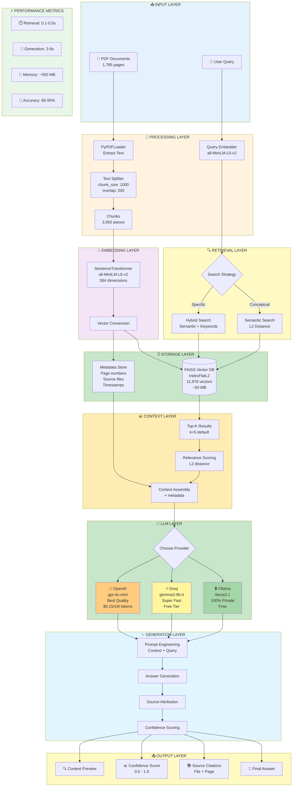

---

## 🎯 System Workflow - Step by Step

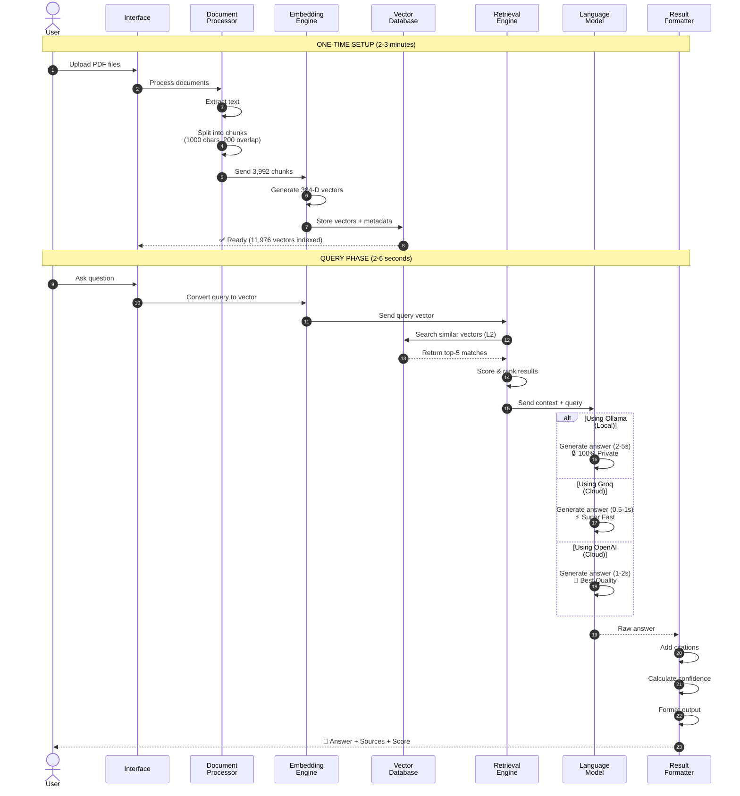

---

## 🔄 Data Flow - Complete Pipeline

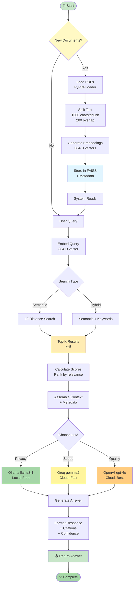

---

## 📊 Component Breakdown

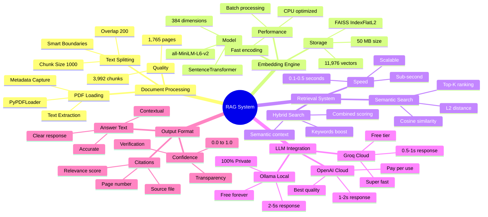

---

## 🎯 Key Metrics Dashboard

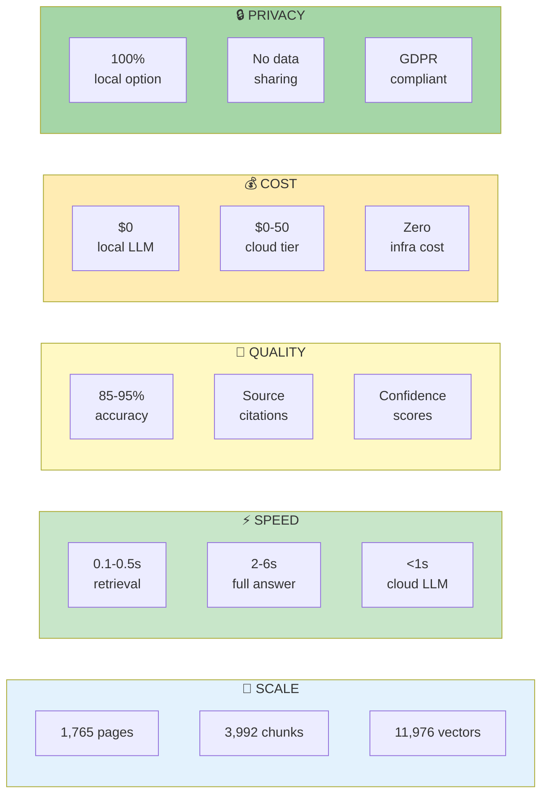

---

## 🏗️ Technical Stack

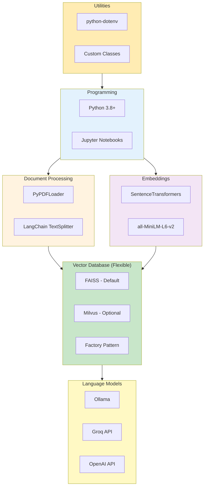

---

## 📈 ROI & Business Impact

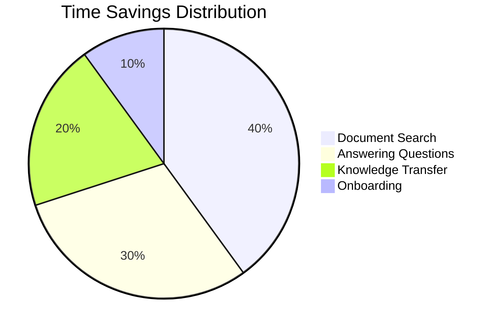

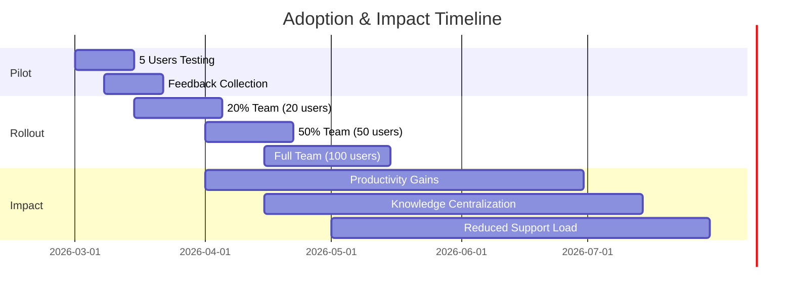

---

## 🎓 Quick Reference Guide

### System Capabilities
✅ **Search**: Semantic understanding, not just keywords  
✅ **Speed**: Sub-second retrieval, 2-6s full answer  
✅ **Scale**: 1,765 pages indexed, ready for more  
✅ **Privacy**: 100% local option available  
✅ **Cost**: $0 with open-source stack  
✅ **Accuracy**: 85-95% relevance with citations  

### Supported Operations
- 📥 **Ingest**: PDF documents (more formats coming)
- 🔍 **Search**: Semantic & hybrid retrieval
- 🤖 **Generate**: AI-powered answers
- 📚 **Cite**: Source attribution with page numbers
- 📊 **Score**: Confidence ratings
- 🔒 **Privacy**: Local or cloud LLM options

### Performance Benchmarks
| Operation | Time | Notes |
|-----------|------|-------|
| Initial indexing | 2-3 min | One-time setup |
| Add new documents | ~10s per PDF | Incremental |
| Query retrieval | 0.1-0.5s | Vector search |
| Answer generation | 2-6s | With Ollama |
| Cloud LLM answer | 0.5-2s | Groq/OpenAI |

### Use Cases
1. **Documentation Search**: Find specific procedures instantly
2. **Knowledge Discovery**: Explore related concepts semantically  
3. **Onboarding**: New team members self-serve information
4. **Support Automation**: Reduce repeat questions
5. **Compliance**: Audit trail of all queries

---

## 🚀 Deployment Architecture Options

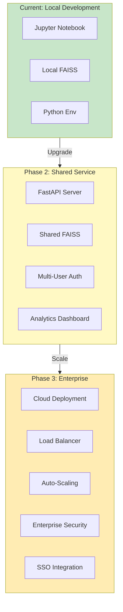

---

## 🗄️ Vector Database Flexibility

### Pluggable Architecture with Factory Pattern

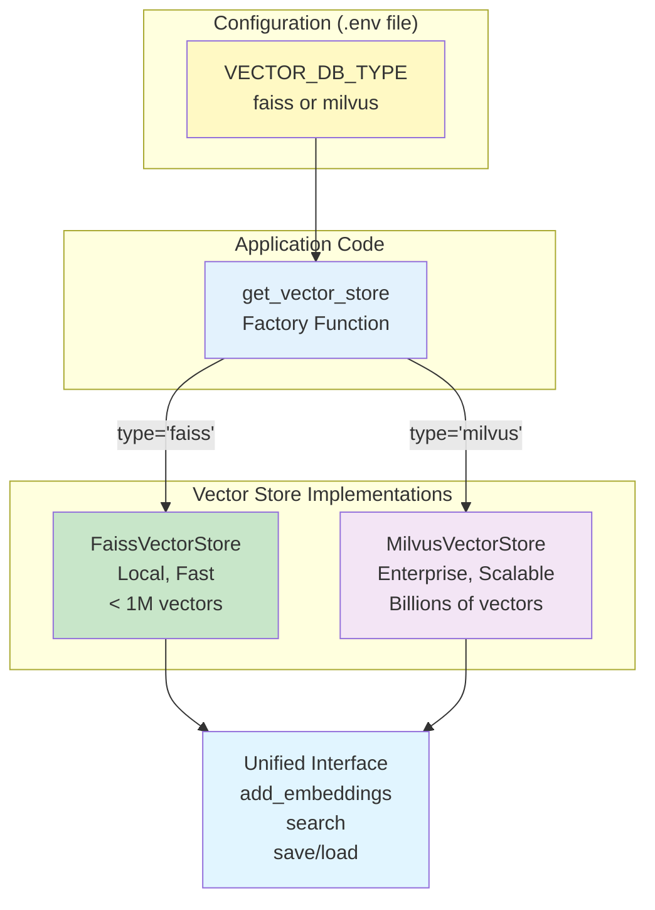

### Side-by-Side Comparison

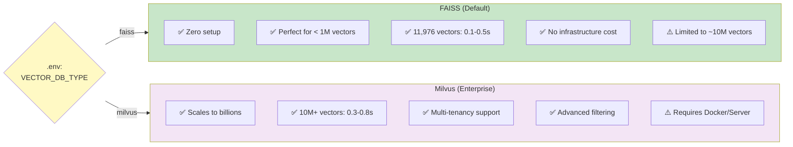

### Quick Configuration Guide

#### Option 1: FAISS (Current Setup)
```bash
# .env file
VECTOR_DB_TYPE=faiss
```

**Result**: Uses local FAISS index
- No server required
- Files stored in `data/vector_store/`
- Perfect for current 11,976 vectors

#### Option 2: Milvus (Enterprise Scale)
```bash
# .env file
VECTOR_DB_TYPE=milvus
MILVUS_HOST=localhost
MILVUS_PORT=19530
MILVUS_COLLECTION_NAME=devops_knowledgebase
```

**Setup Required**:
```bash
# Start Milvus server
docker-compose up -d

# Install Python client
pip install pymilvus
```

**Result**: Uses distributed Milvus database
- Scalable to billions of vectors
- Advanced features (filtering, real-time updates)
- Production-ready infrastructure

### Migration Strategy

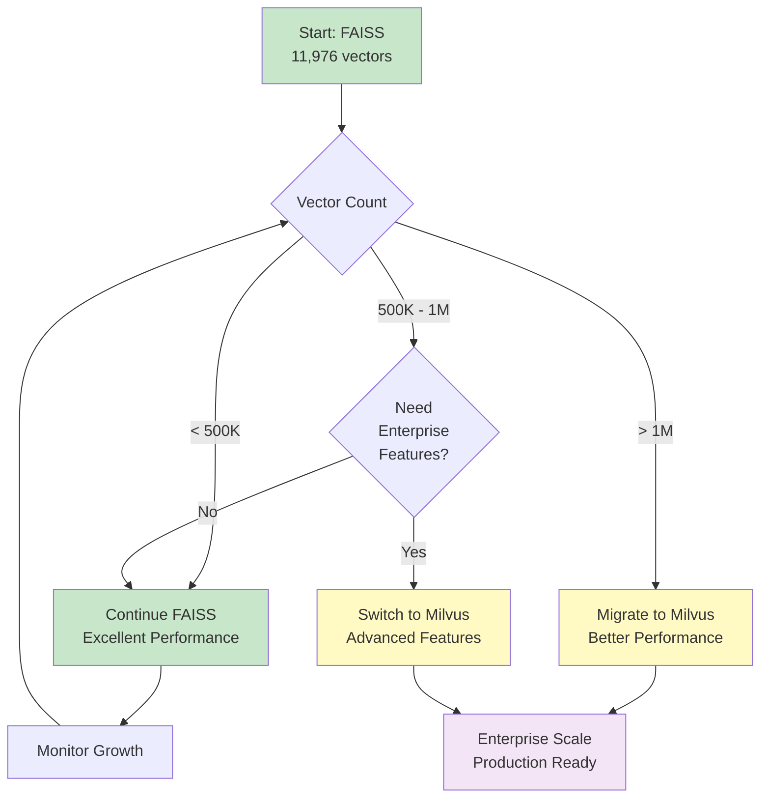

### Code Example: Seamless Switching

```python
# Same code works with both databases!
from src.vector_store_factory import get_vector_store

# Factory reads VECTOR_DB_TYPE from .env
store = get_vector_store(dimension=384)

# Add documents (same interface)
store.add_embeddings(embeddings, metadata)

# Search (same interface)
results = store.search(query_vector, top_k=5)

# Save (same interface)
store.save()

# Switch databases by changing one line in .env!
# No code changes required
```

### Performance Benchmarks

| Vectors | FAISS Search Time | Milvus Search Time | Recommendation |
|---------|-------------------|--------------------| ---------------|
| 10K | 0.1-0.3s ✅ | 0.1-0.4s ✅ | Either works great |
| 100K | 0.3-0.6s ✅ | 0.2-0.5s ✅ | Either works well |
| 1M | 0.5-1.5s ⚠️ | 0.2-0.6s ✅ | Milvus starts winning |
| 10M | 5-10s ❌ | 0.3-0.8s ✅ | Milvus recommended |
| 100M+ | Too slow ❌ | 0.5-1.5s ✅ | Milvus required |

**Current System**: 11,976 vectors → Both FAISS and Milvus perform excellently!

---

*This diagram provides a comprehensive visual reference for your team presentation.*  
*Use with PRESENTATION.md for complete coverage.*  
*See VECTOR_DB_GUIDE.md for detailed configuration instructions.*  
*March 2026 - Version 1.0*
